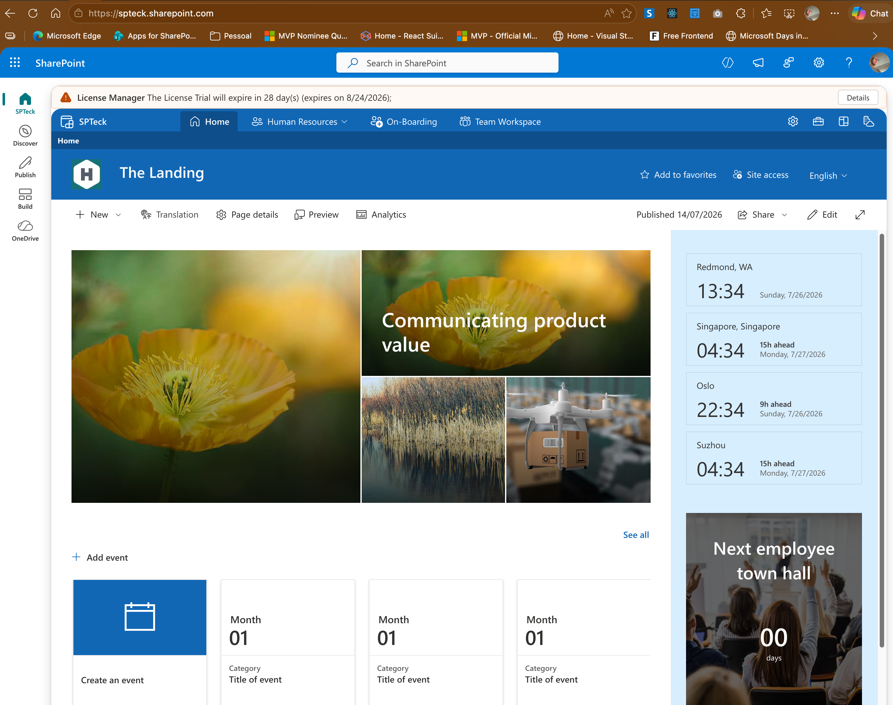
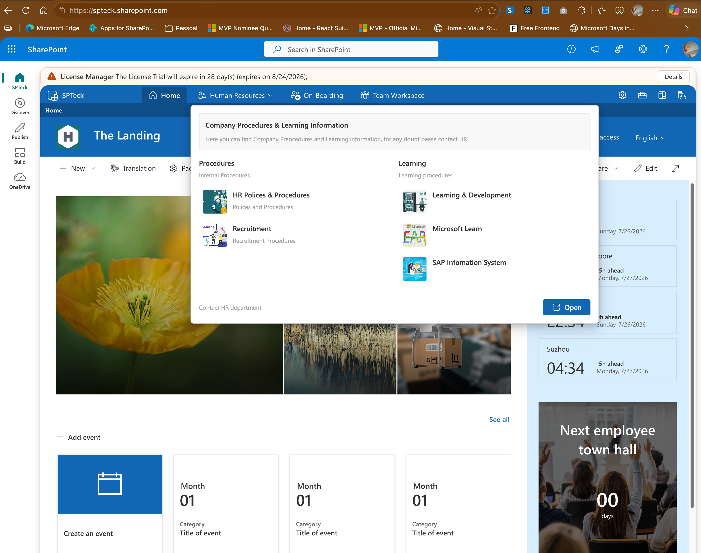
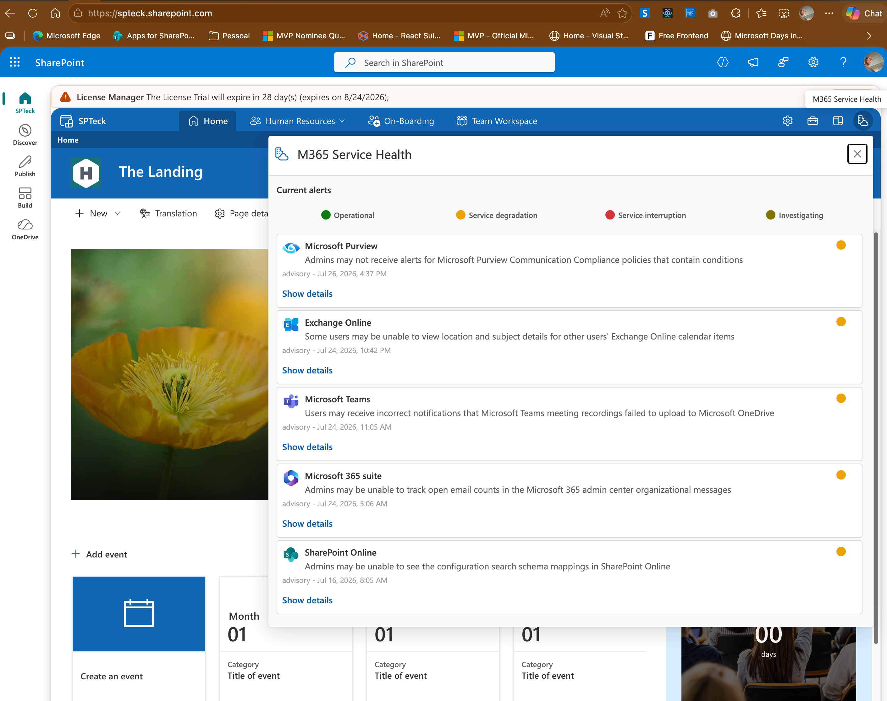
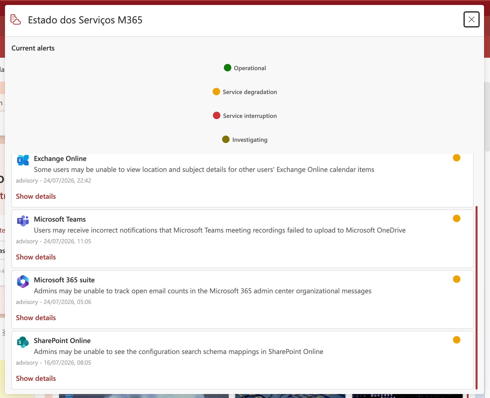
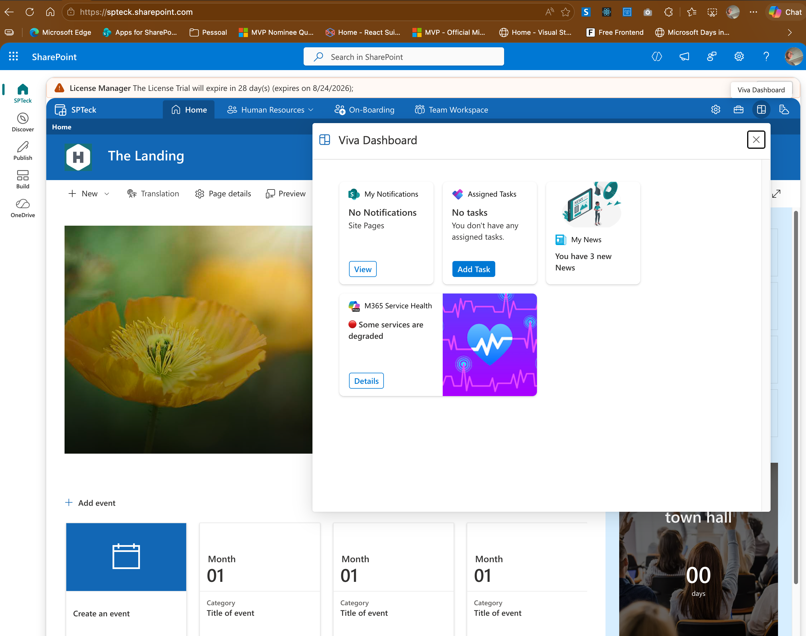
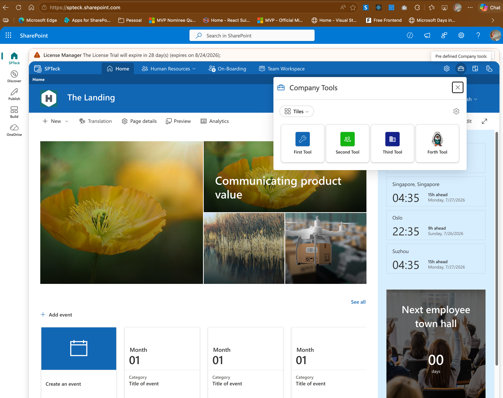
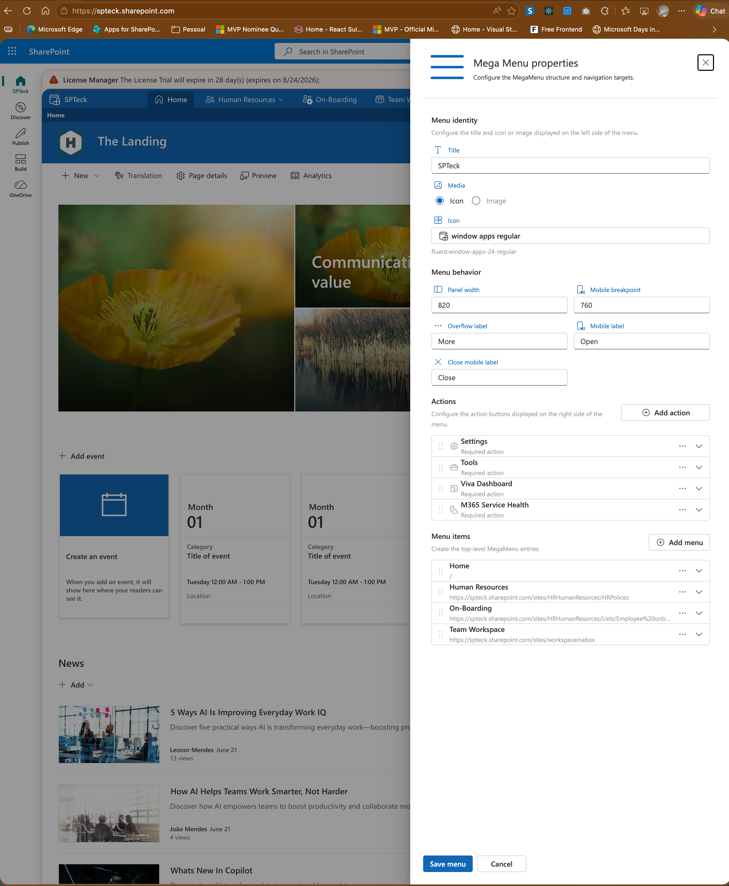
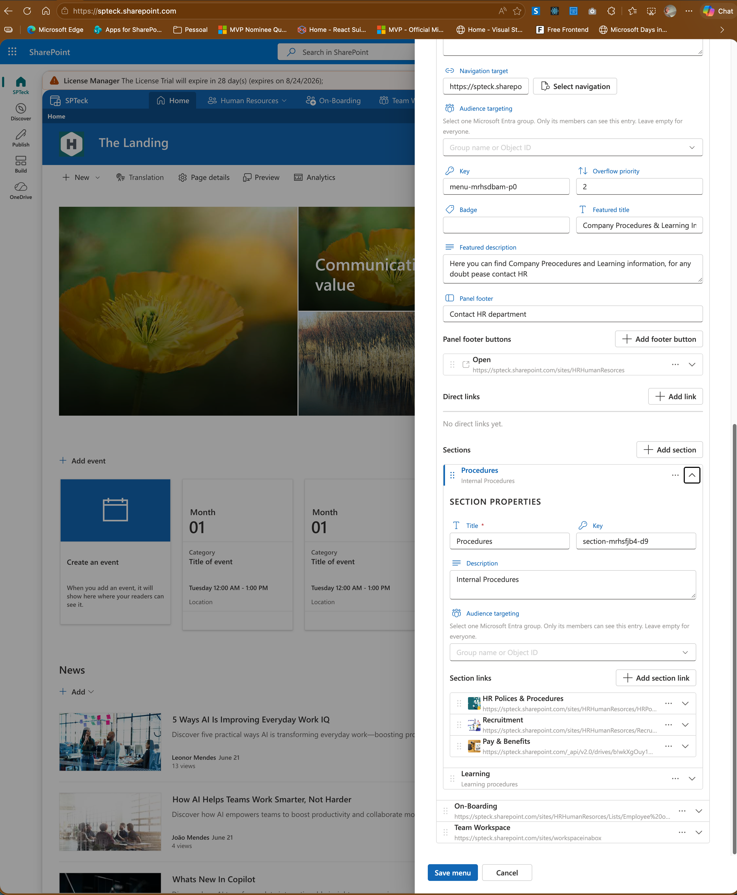
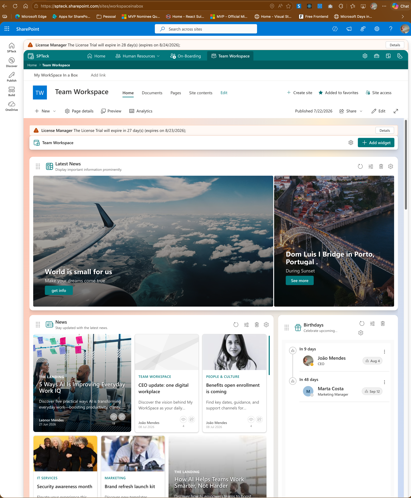

# Tenant Wide Mega Menu preview

These screenshots show the Mega Menu running on modern SharePoint Online pages. Select any image to open it at full resolution.

## Tenant-wide navigation

The shared navigation appears consistently at the top of modern SharePoint pages and provides menu entries, administrator settings, Company Tools, Viva Dashboard, and Microsoft 365 Service Health actions.

## Featured menu panel

Menu entries can open rich panels containing a featured title and description, multiple sections, images, audience-targeted links, and footer actions.

## Microsoft 365 Service Health

The Service Health action presents current Microsoft 365 advisories without requiring users to leave the SharePoint page.

### Localized Service Health view

Widget labels and service information follow the user's supported language and regional settings.

## Viva Dashboard

The Viva Dashboard action brings together personal notifications, assigned tasks, news, and service status.

## Company Tools

Users can launch centrally managed company tools in a compact tile or list view.

## Menu administration

### Menu identity, behavior, actions, and entries

Authorized managers can configure the menu identity, responsive behavior, action buttons, and top-level entries.

### Featured content, targeting, sections, and links

Each entry can include audience targeting, featured content, footer buttons, direct links, and multi-column sections.

## Workspace in a Box integration

The Tenant Wide Mega Menu remains available when users navigate to a Workspace in a Box team workspace.

[Download the latest package](https://github.com/joaojmendes/tenant-wide-mega-menu/raw/main/sharepoint-mega-menu.sppkg) · [Read the installation guide](INSTALLATION.md) · [Report a problem](https://github.com/joaojmendes/tenant-wide-mega-menu/issues/new/choose)
